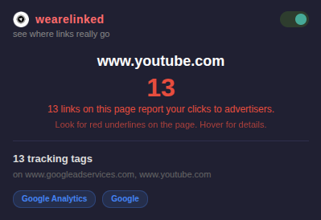

# wearelinked

> See where links really go before you click.

Every time you click a link, it might not go where you think. Sites wrap URLs through tracking servers, add invisible parameters to monitor your clicks, and hide the real destination behind redirect chains. wearelinked scans every link on the page and shows you what's really happening. Flagged links get a red underline right on the page. Hover for a tooltip breakdown. Open the popup for a full count.

Everything runs locally in your browser — no data is collected, transmitted, or shared.

## What it detects
- **Redirect wrappers** — Google, Facebook, YouTube, and Outlook redirect URLs unwrapped to show the real destination
- **URL shorteners** — t.co, bit.ly, tinyurl.com, ow.ly, goo.gl flagged as hiding the real destination
- **Tracking parameters** — `utm_source`, `fbclid`, `gclid`, `msclkid`, `_ga`, `twclid`, `ttclid`, and 20+ more stripped and shown
- **Mail redirects** — click.redditmail.com and similar email tracking redirects exposed

## Try It Now

Store approval pending — install locally in under a minute:

### Chrome
1. Download this repo (Code → Download ZIP) and unzip
2. Go to `chrome://extensions` and turn on **Developer mode** (top right)
3. Click **Load unpacked** → select the `chrome-extension` folder
4. That's it — browse any site and click the extension icon

### Firefox
1. Download this repo (Code → Download ZIP) and unzip
2. Go to `about:debugging#/runtime/this-firefox`
3. Click **Load Temporary Add-on** → pick any file in the `firefox-extension` folder
4. That's it — browse any site and click the extension icon

> Firefox temporary add-ons reset when you close the browser — just re-load next session.

---

## The weare____ Suite

Privacy tools that show what's happening — no cloud, no accounts, nothing leaves your browser.

| Extension | What it exposes |
|-----------|----------------|
| [wearecooked](https://github.com/hamr0/wearecooked) | Cookies, tracking pixels, and beacons |
| [wearebaked](https://github.com/hamr0/wearebaked) | Network requests, third-party scripts, and data brokers |
| [weareleaking](https://github.com/hamr0/weareleaking) | localStorage and sessionStorage tracking data |
| **wearelinked** | Redirect chains and tracking parameters in links |
| [wearewatched](https://github.com/hamr0/wearewatched) | Browser fingerprinting and silent permission access |
| [weareplayed](https://github.com/hamr0/weareplayed) | Dark patterns: fake urgency, confirm-shaming, pre-checked boxes |
| [wearetosed](https://github.com/hamr0/wearetosed) | Toxic clauses in privacy policies and terms of service |
| [wearesilent](https://github.com/hamr0/wearesilent) | Form input exfiltration before you click submit |

All extensions run entirely on your device and work on Chrome and Firefox.
